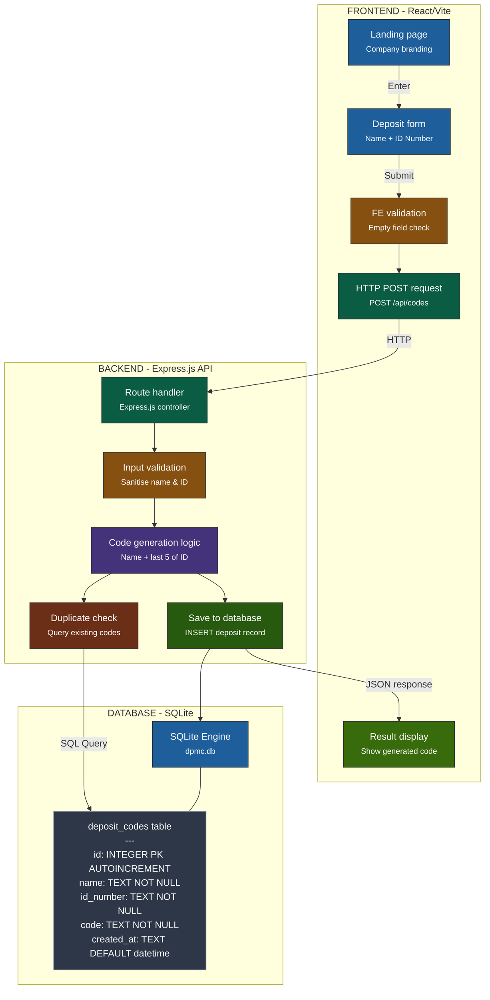

# David Pieris Solar System (DPMC) - Code Generator

A full-stack application built for generating and persisting deposit codes. It features a responsive React (Vite) frontend, an Express.js backend, and a self-contained SQLite database.

---

## 📊 System Architecture & Flow

Here is the data and process flow from the Frontend to the Backend API and SQLite Database:



---

## 🗄️ Database Schema & Details

The database is built on **SQLite**, which stores all data locally inside a single database file.

### Database File Location
`dpmc-database/dpmc.db` *(Auto-generated when the backend runs)*

### Table: `deposit_codes`

| Column Name | Data Type | Key / Constraint | Description |
| :--- | :--- | :--- | :--- |
| `id` | `INTEGER` | `PRIMARY KEY AUTOINCREMENT` | Auto-incremented Unique ID |
| `name` | `TEXT` | `NOT NULL` | Depositor's full/short name |
| `id_number` | `TEXT` | `NOT NULL` | Depositor's ID number (NIC/Passport) |
| `code` | `TEXT` | `NOT NULL` | The unique generated code |
| `created_at` | `TEXT` | `DEFAULT (datetime('now'))` | Timestamp of code creation |

---

## ⚙️ Running Locally

Follow these instructions to start both parts of the application.

### 1. Backend Server
Open a terminal in the `dpmc-backend` folder:
```bash
cd dpmc-backend
npm run dev
```
* **Runs on:** http://localhost:5000
* **Interactive Inspection:** Run `node view-db.js` in the backend folder to view database entries in a table format directly from your CLI.

### 2. Frontend App
Open another terminal in the `dpmc-frontend` folder:
```bash
cd dpmc-frontend
npm run dev
```
* **Runs on:** http://localhost:5173

---

## 🌐 Deploying & Hosting

To host the backend and SQLite database online, follow these requirements:

1. **Persistent Volume**: Since SQLite is file-based, you must use a cloud host that supports persistent volumes/disks (such as **Render.com**, **Railway.app**, **Fly.io**, or any standard **Linux VPS**).
2. **Environment Variable**: Configure the database location using the `DATABASE_PATH` environment variable in your production environment:
   ```env
   DATABASE_PATH=/opt/dpmc-database/dpmc.db
   ```
